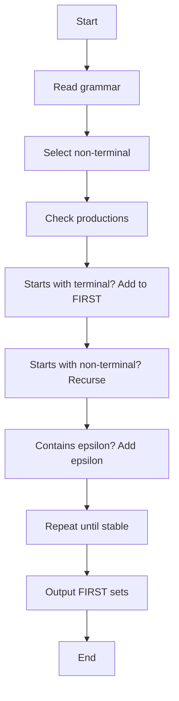
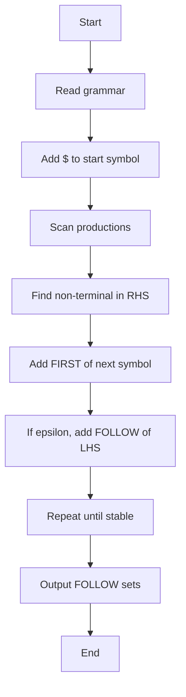
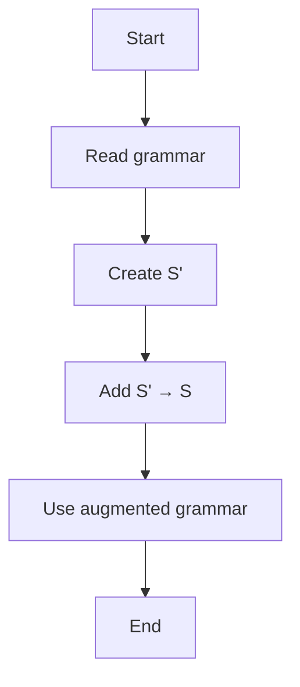
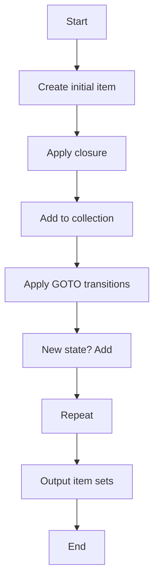
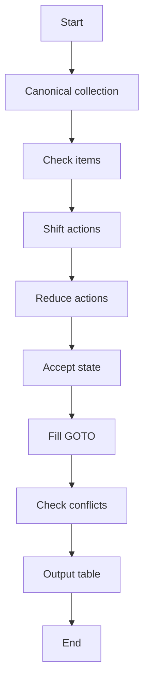

# ParseGen

```{=html}
<p align="center">
```
``{=html}
```{=html}
</p>
```
```{=html}
<p align="center">
```
`<b>`{=html}A web-based tool to generate LL(1) and LR(0) parser
components from a given Context-Free Grammar (CFG)`</b>`{=html}
```{=html}
</p>
```

------------------------------------------------------------------------

## Live Demo

> 🔗 Link: *(will be added later)*

------------------------------------------------------------------------

## Demo Preview

```{=html}
<p align="center">
```
``{=html}
```{=html}
</p>
```

------------------------------------------------------------------------

## Overview

ParseGen is a compiler design project that automates the process of
generating parsing structures from a given CFG.

It performs:

-   FIRST set computation\
-   FOLLOW set computation\
-   LL(1) parsing table generation\
-   Grammar augmentation for LR(0)\
-   Canonical LR(0) item set generation\
-   LR(0) ACTION & GOTO table construction

The core parsing logic is implemented in C, compiled into WebAssembly,
and integrated into a web interface using HTML, CSS, and JavaScript.

------------------------------------------------------------------------

## Architecture / Workflow

``` mermaid
flowchart LR
    A[C Source Code] --> B[Emscripten]
    B --> C[WebAssembly (.wasm)]
    C --> D[HTML]
    C --> E[CSS]
    C --> F[JavaScript]
    D --> G[ParseGen Web App]
    E --> G
    F --> G
```

------------------------------------------------------------------------

## Features

-   CFG input support\
-   FIRST set generation\
-   FOLLOW set generation\
-   LL(1) parse table creation\
-   Grammar augmentation for LR(0)\
-   Canonical LR(0) item set generation\
-   LR(0) parsing table (ACTION / GOTO)\
-   Clean web-based interface

------------------------------------------------------------------------

## How It Works

1.  Parsing algorithms are implemented in C\
2.  The C code is compiled into WebAssembly (.wasm) using Emscripten\
3.  The .wasm module is integrated with JavaScript\
4.  The frontend (HTML/CSS) provides an interactive UI\
5.  The browser executes parsing logic via WebAssembly

------------------------------------------------------------------------

# Algorithms

## FIRST Set Algorithm



------------------------------------------------------------------------

## FOLLOW Set Algorithm



------------------------------------------------------------------------

## LL(1) Parse Table Construction

``` mermaid
flowchart TD
    A[Start] --> B[Compute FIRST & FOLLOW]
    B --> C[For each production A → α]
    C --> D[Add to table using FIRST(α)]
    D --> E[If epsilon in FIRST(α)]
    E --> F[Use FOLLOW(A)]
    F --> G[Check conflicts]
    G --> H[Output LL(1) table]
    H --> I[End]
```

------------------------------------------------------------------------

## Grammar Augmentation (LR(0))



------------------------------------------------------------------------

## Canonical LR(0) Item Set



------------------------------------------------------------------------

## LR(0) Parsing Table



------------------------------------------------------------------------

## Tech Stack

-   C -- Core parsing algorithms\
-   Emscripten -- C → WebAssembly compilation\
-   WebAssembly (WASM) -- High-performance execution\
-   JavaScript -- WASM integration\
-   HTML & CSS -- Frontend UI

------------------------------------------------------------------------

## Usage

1.  Enter a CFG in the input field\
2.  Click the desired operation\
3.  View generated outputs

------------------------------------------------------------------------

## Contributing & License

This project operates under a split-licensing model to support open-source collaboration while preserving the integrity of our instructional materials. The software source code is strictly governed by the MIT License, permitting broad use and modification. Conversely, all project documentation is licensed under Creative Commons Attribution-NoDerivatives 4.0 International (CC BY-ND 4.0), which allows for sharing but prohibits the distribution of modified versions. For the complete legal text and specific terms of these licenses, please refer to the LICENSE and LICENSE-docs files located in the root of our official source repository.
  
We welcome Pull Requests for code bug fixes and features, but please do not submit changes to the documentation text.

------------------------------------------------------------------------

## Acknowledgements

We sincerely thank our supervisor for guidance and support.

We also thank all team members for their dedication in completing
ParseGen.

### Proposed working diagram:
  


